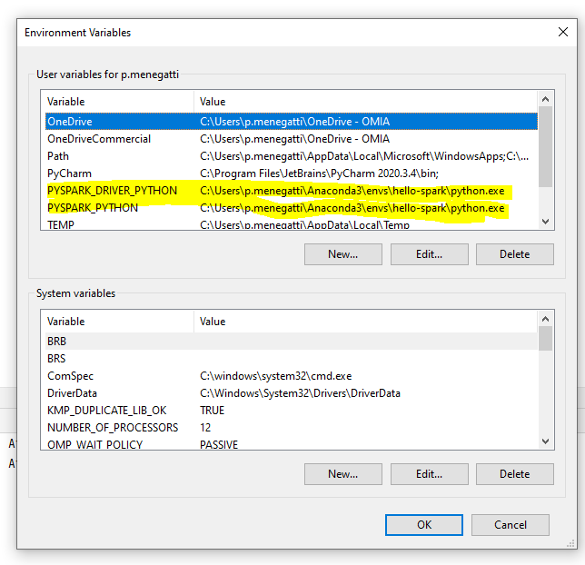

# Installazione

Installato usando l'environnement seguente con conda:

```conda
name: hello-spark
channels:
    - defaults
    - conda-forge
dependencies:
    - openjdk
    - jupyter
    - ipython
    - numpy
    - numpy-base
    - pandas
    - py4j
    - pyspark
    - pytz
    - findspark
```

Ricordarsi poi di ca,biare le variabili windows d'ambiente :


# Presa in mano


Dal terminale, per avviare velocemente spark:

`pyspark`

# Concetti

## Trasformazioni

- **Narrow transformation**: Quando ogni riga di risultato ha bisogno di utilizzare al massimo un riga dei dati di partenza
- **Wide trasformation**: Quando almeno una riga del risultato ha bisogno di più di una riga dei dati di partenza (*shuffle*)

**Lazy evaluation**: spark aspetta l'ultimo momento per calcolare le trasformazioni. Nell'attesa crea un *piano*. Questo permetterà di ottimizzare i calcoli alla fine.

**Azione**: Attiva il calcolo della trasformazione